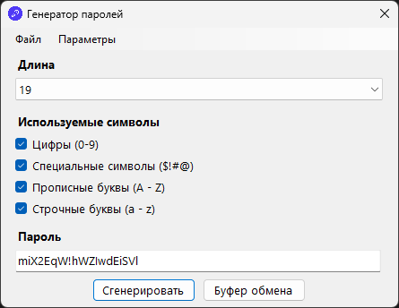
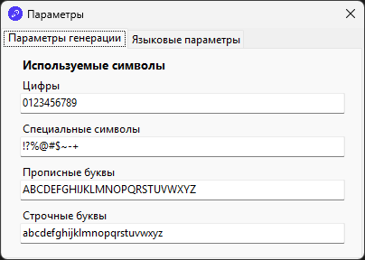

# Password Generator 🔐

Простой генератор паролей для Windows, разработанный на C# WinForms. Приложение позволяет генерировать пароли с настраиваемыми параметрами.




## 📋 Функциональность

### 🔧 Генерация паролей
- Настройка длины пароля (6-32 символов)
- Выбор типов символов:
  - Цифры (0-9)
  - Прописные буквы (A-Z)
  - Строчные буквы (a-z)
  - Специальные символы (!@#$%^&* и др.)

### ⚙️ Настройки
- **Кастомизация наборов символов** - можно указать свои символы для каждой категории
- **Поддержка двух языков** - русский и английский интерфейс
- **Автоматическое определение языка** - на основе системных настроек

### 📊 История и экспорт
- Сохранение истории сгенерированных паролей
- Очистка истории
- Экспорт истории в текстовый файл
- Копирование пароля в буфер обмена

## 🚀 Запуск проекта

### Требования
- .NET Framework 4.7.2
- Visual Studio 2019/2022

### Инструкция по сборке
1. Клонируйте репозиторий
2. Откройте решение в Visual Studio
3. Соберите решение (Ctrl+Shift+B)
4. Запустите проект (F5)

## 🎮 Использование

### Основные шаги:
1. **Выберите длину пароля** из выпадающего списка
2. **Отметьте нужные типы символов** (галочками)
3. **Нажмите "Сгенерировать"** для создания пароля
4. **Используйте кнопку копирования** для помещения пароля в буфер обмена

### Дополнительные возможности:
- **История** - меню "Файл" → "История"
- **Настройки символов** - меню "Параметры" → "Параметры генерации"
- **Смена языка** - меню "Параметры" → "Языковые параметры"
- **Сброс настроек** - меню "Параметры" → "Сброс параметров"

## 🏗️ Архитектура проекта

### Основные классы:
- **`PasswordGenerator`** - ядро генерации паролей
- **`StartForm`** - главное окно приложения
- **`SettingsForm`** - окно настроек
- **`HistoryForm`** - окно истории

### Структура файлов:
```
PasswordGenerator/
├── Classes/
│   └── PasswordGenerator.cs     # Логика генерации паролей
├── UI/
│   ├── StartForm.cs             # Главное окно
│   ├── SettingsForm.cs          # Настройки приложения
│   └── HistoryForm.cs           # История паролей
├── Properties/
│   └── Settings.settings        # Хранение настроек пользователя
└── Resources/                   # Локализация
```

## 👤 Автор

Проект был разработан в рамках обучения программированию на C# и WinForms. Демонстрирует применение различных технологий Windows Forms, включая локализацию, сохранение настроек и работу с файлами.
